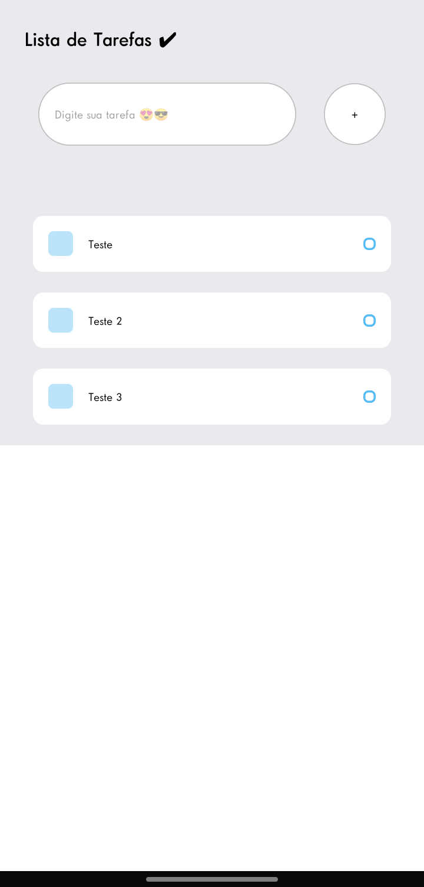

<h1 align="center">
  <a href="#" alt="Todo list"> Todo List </a>
</h1>

  <a href="#-tecnologias">Tecnologias</a>&nbsp;&nbsp;&nbsp;|&nbsp;&nbsp;&nbsp;
  <a href="#-projeto">Projeto</a>&nbsp;&nbsp;&nbsp;|&nbsp;&nbsp;&nbsp;
  <a href="#memo-licença">Licença</a>

 

  

 

  

## 🚀 Tecnologias

Esse projeto foi desenvolvido com as seguintes tecnologias:

- React-Native
- Expo

## 💻 Projeto

Este projeto é um aplicativo Todo List, com foco em profissionais de TI, para que os mesmos possam se lembrar dos atendimentos que vem ser feitos.

## :memo: Licença

Esse projeto está sob a licença MIT. Veja o arquivo [LICENSE](LICENSE.md) para mais detalhes.

---

